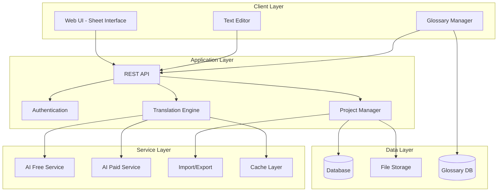
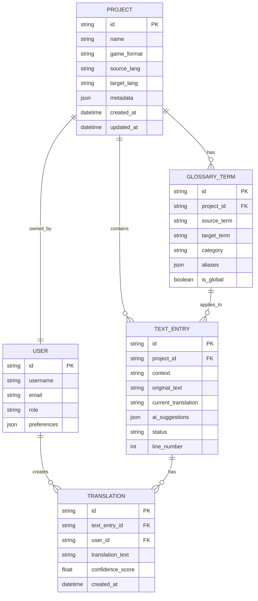
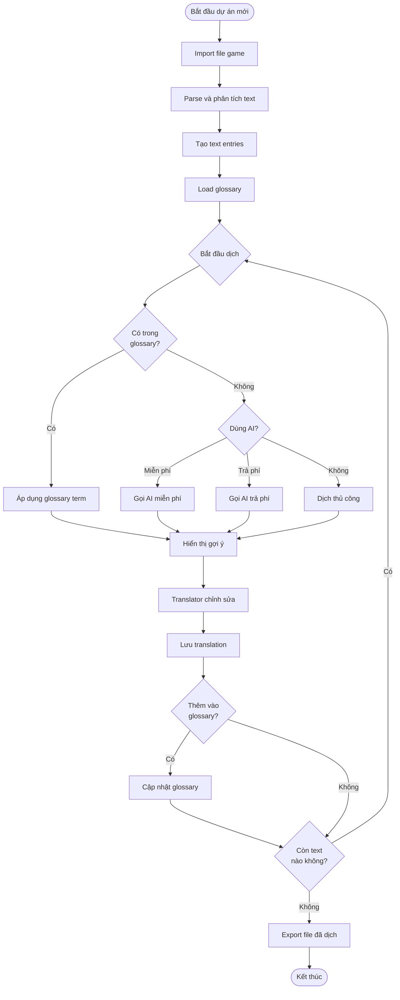
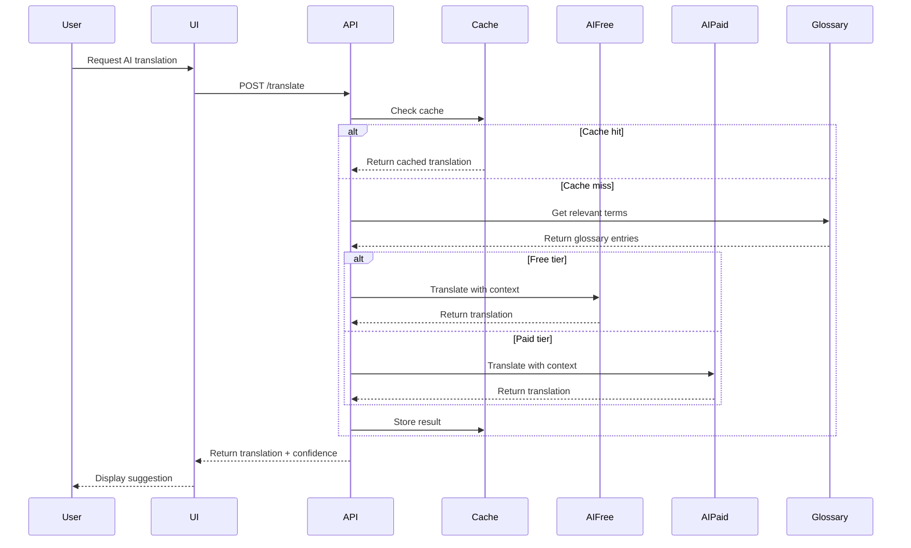
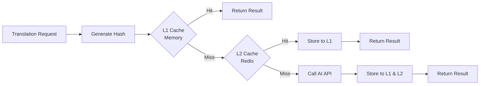
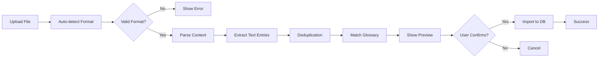
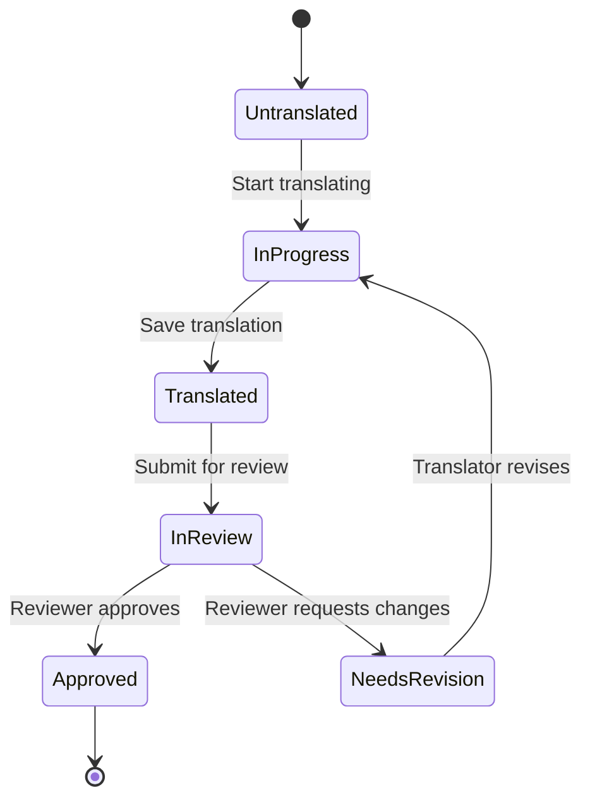
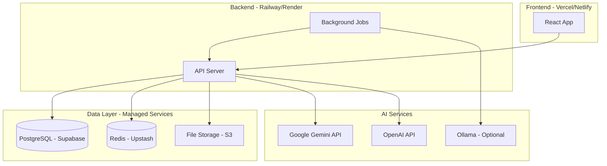

# Kiến Trúc Công Cụ Dịch Thuật Text Game

## 1. Tổng Quan Hệ Thống

### 1.1 Mục Đích
Công cụ dịch thuật chuyên biệt cho text game với các tính năng:
- 📚 **Quản lý Glossary**: Từ điển thuật ngữ riêng cho từng game
- 🎮 **Quản lý Dự án**: Tạo và quản lý nhiều dự án game độc lập
- 📊 **Giao diện Sheet**: Bảng làm việc trực quan như Excel/Google Sheets
- 🤖 **AI Translation**: Gợi ý dịch tự động từ AI (miễn phí + trả phí)
- 👥 **Cộng tác**: Làm việc nhóm với nhiều translator

### 1.2 Kiến Trúc Tổng Thể



## 2. Các Thành Phần Chính

### 2.1 Frontend Components

#### Sheet-like Interface
```
┌─────────────────────────────────────────────────────────┐
│ Game Project: Visual Novel XYZ        [Export] [Import] │
├─────────────────────────────────────────────────────────┤
│ ID  │ Context      │ Original Text  │ Translation │ AI  │
├─────┼──────────────┼────────────────┼─────────────┼─────┤
│ 001 │ dialogue     │ Hello          │ Xin chào    │ 💡  │
│ 002 │ menu         │ Start Game     │ Bắt đầu     │ 💡  │
│ 003 │ item_desc    │ Sword          │ Kiếm        │ 💡  │
└─────┴──────────────┴────────────────┴─────────────┴─────┘
```

**Tính năng:**
- ✅ Scroll ảo cho hiệu năng cao
- ✅ Filter và search mạnh mẽ
- ✅ In-line editing
- ✅ Bulk operations
- ✅ Undo/Redo
- ✅ Auto-save

#### Glossary Manager
```
┌─────────────────────────────────────────────┐
│ Glossary: Visual Novel XYZ                  │
├─────────────────────────────────────────────┤
│ Term (EN)    │ Translation (VI) │ Category  │
├──────────────┼──────────────────┼───────────┤
│ HP           │ Máu              │ Game Term │
│ Main Character│ Nhân vật chính  │ Story     │
│ Dragon       │ Rồng             │ Monster   │
└──────────────┴──────────────────┴───────────┘
```

### 2.2 Backend Architecture

#### Database Schema



## 3. Luồng Hoạt Động Chính

### 3.1 Workflow Dịch Thuật



### 3.2 AI Translation Flow



## 4. Tích Hợp AI Services

### 4.1 AI Services Hierarchy

| Tier | Service | Cost | Features |
|------|---------|------|----------|
| Free | Gemini Flash | Miễn phí | Basic translation, 60 req/min |
| Free | Ollama (Local) | Miễn phí | Offline, unlimited, slower |
| Paid | OpenAI GPT-4o | Pay-as-go | High quality, context-aware |
| Paid | Claude Sonnet | Pay-as-go | Best for narrative games |

### 4.2 AI Prompt Strategy

```typescript
interface TranslationPrompt {
  systemPrompt: string;
  context: {
    gameGenre: string;
    characterContext?: string;
    previousDialogue?: string[];
    glossaryTerms: GlossaryTerm[];
  };
  originalText: string;
  targetLanguage: string;
}

// Example prompt template
const promptTemplate = `
Bạn là translator chuyên nghiệp cho game.

Game context:
- Genre: {gameGenre}
- Character: {characterContext}

Glossary terms phải sử dụng:
{glossaryTerms}

Previous dialogue:
{previousDialogue}

Hãy dịch text sau sang {targetLanguage}:
"{originalText}"

Yêu cầu:
1. Giữ nguyên tone của character
2. Sử dụng đúng thuật ngữ từ glossary
3. Phù hợp với context trước đó
`;
```

### 4.3 Caching Strategy



## 5. Import/Export System

### 5.1 Supported Formats

```typescript
interface GameFormat {
  name: string;
  extensions: string[];
  parser: FormatParser;
  exporter: FormatExporter;
}

const supportedFormats: GameFormat[] = [
  {
    name: 'JSON',
    extensions: ['.json'],
    parser: JSONParser,
    exporter: JSONExporter
  },
  {
    name: 'Ren\'Py',
    extensions: ['.rpy'],
    parser: RenPyParser,
    exporter: RenPyExporter
  },
  {
    name: 'CSV',
    extensions: ['.csv', '.tsv'],
    parser: CSVParser,
    exporter: CSVExporter
  },
  {
    name: 'XML',
    extensions: ['.xml'],
    parser: XMLParser,
    exporter: XMLExporter
  },
  {
    name: 'RPG Maker',
    extensions: ['.json'],
    parser: RPGMakerParser,
    exporter: RPGMakerExporter
  }
];
```

### 5.2 Import Process



## 6. Collaboration Features

### 6.1 User Roles

```typescript
enum UserRole {
  ADMIN = 'admin',           // Full access
  TRANSLATOR = 'translator', // Can translate & edit
  REVIEWER = 'reviewer',     // Can review & approve
  VIEWER = 'viewer'          // Read-only access
}

interface Permission {
  canEdit: boolean;
  canReview: boolean;
  canManageGlossary: boolean;
  canExport: boolean;
  canManageUsers: boolean;
}
```

### 6.2 Translation Status Workflow



## 7. Technical Stack Recommendations

### 7.1 Option 1: Web-based (Recommended)

**Frontend:**
```
- Framework: React + TypeScript
- UI Library: Shadcn/ui + Tailwind CSS
- Sheet Component: AG Grid hoặc TanStack Table
- State Management: Zustand hoặc Redux Toolkit
- Real-time: Socket.io
```

**Backend:**
```
- Runtime: Node.js với Express hoặc Fastify
- Database: PostgreSQL + Prisma ORM
- Cache: Redis
- File Storage: MinIO hoặc AWS S3
- Auth: JWT + bcrypt
```

**AI Integration:**
```
- Free: Google Gemini API, Ollama
- Paid: OpenAI API, Anthropic Claude API
```

### 7.2 Option 2: Desktop App

**Technology:**
```
- Framework: Tauri + React
- Database: SQLite (local)
- Benefits: Offline-first, no hosting costs
```

## 8. Data Flow Example

### 8.1 Complete Translation Flow

```typescript
// 1. User uploads game file
const file = await uploadGameFile('game_script.json');

// 2. Parse and extract text
const entries = await parseGameFile(file, 'rpg-maker');
// entries = [
//   { id: 1, context: 'dialogue', text: 'Hello, traveler!' },
//   { id: 2, context: 'item', text: 'Health Potion' }
// ]

// 3. Load project glossary
const glossary = await getProjectGlossary(projectId);
// glossary = [
//   { source: 'Health Potion', target: 'Thuốc Hồi Máu' },
//   { source: 'traveler', target: 'lữ khách' }
// ]

// 4. Apply glossary auto-translation
const withGlossary = applyGlossary(entries, glossary);
// entry[2] -> "Thuốc Hồi Máu" (auto-applied)

// 5. Request AI suggestion for remaining
const suggestion = await getAITranslation({
  text: 'Hello, traveler!',
  context: 'dialogue',
  glossary: ['traveler -> lữ khách'],
  service: 'gemini-flash' // or 'gpt-4o' for paid
});
// suggestion = {
//   translation: 'Xin chào, lữ khách!',
//   confidence: 0.95,
//   alternatives: ['Chào mừng, lữ khách!']
// }

// 6. Translator reviews and edits
const finalTranslation = await saveTranslation({
  entryId: 1,
  translation: 'Chào bạn, lữ khách!',
  source: 'ai-assisted'
});

// 7. Export translated file
const output = await exportProject(projectId, 'rpg-maker');
```

## 9. Performance Considerations

### 9.1 Optimization Strategies

```typescript
// Virtual scrolling for large datasets
interface VirtualScrollConfig {
  rowHeight: 40;          // Fixed row height
  overscan: 10;           // Render extra rows
  bufferSize: 100;        // Items to keep in memory
}

// Lazy loading translations
const loadTranslations = async (page: number, limit: number) => {
  return await db.textEntry.findMany({
    skip: page * limit,
    take: limit,
    include: {
      translations: true,
      glossaryMatches: true
    }
  });
};

// Debounced auto-save
const autoSave = debounce(async (data) => {
  await saveTranslation(data);
}, 2000);
```

### 9.2 Caching Strategy

```typescript
interface CacheConfig {
  // L1: In-memory cache (10MB max)
  l1: {
    maxSize: 10 * 1024 * 1024,
    ttl: 300 // 5 minutes
  },
  
  // L2: Redis cache (100MB max)
  l2: {
    maxSize: 100 * 1024 * 1024,
    ttl: 3600 // 1 hour
  },
  
  // Keys to cache
  cacheKeys: [
    'translation:*',
    'glossary:*',
    'ai-suggestion:*'
  ]
}
```

## 10. API Endpoints Design

### 10.1 Core APIs

```typescript
// Projects
POST   /api/projects                    // Create project
GET    /api/projects                    // List projects
GET    /api/projects/:id                // Get project
PUT    /api/projects/:id                // Update project
DELETE /api/projects/:id                // Delete project

// Text Entries
GET    /api/projects/:id/entries        // List entries (paginated)
POST   /api/projects/:id/entries        // Bulk create entries
PUT    /api/entries/:id                 // Update entry
DELETE /api/entries/:id                 // Delete entry

// Translations
POST   /api/entries/:id/translate       // Create translation
GET    /api/entries/:id/translations    // Get translation history
PUT    /api/translations/:id            // Update translation

// Glossary
GET    /api/projects/:id/glossary       // Get project glossary
POST   /api/projects/:id/glossary       // Add term
PUT    /api/glossary/:id                // Update term
DELETE /api/glossary/:id                // Delete term

// AI Services
POST   /api/ai/translate                // Get AI translation
POST   /api/ai/translate/batch          // Batch translation
GET    /api/ai/services                 // List available AI services

// Import/Export
POST   /api/projects/:id/import         // Import game file
GET    /api/projects/:id/export         // Export translated file
```

## 11. Security & Privacy

### 11.1 Security Measures

```typescript
// Authentication
- JWT tokens với refresh token mechanism
- Password hashing với bcrypt (rounds: 12)
- Rate limiting: 100 requests/minute per IP

// Authorization
- Role-based access control (RBAC)
- Project-level permissions
- API key for AI services (encrypted)

// Data Protection
- Encryption at rest cho sensitive data
- HTTPS only
- Input sanitization
- SQL injection prevention (Prisma ORM)
```

## 12. Deployment Architecture



## 13. Pricing Model (Optional)

### 13.1 Free Tier
- ✅ 1 project
- ✅ 1000 text entries per project
- ✅ Basic glossary (100 terms)
- ✅ AI translations: Gemini Flash only
- ✅ Community support

### 13.2 Pro Tier ($9.99/month)
- ✅ Unlimited projects
- ✅ Unlimited text entries
- ✅ Advanced glossary (unlimited)
- ✅ All AI services (OpenAI, Claude)
- ✅ Priority support
- ✅ Team collaboration (5 users)

### 13.3 Team Tier ($29.99/month)
- ✅ Everything in Pro
- ✅ Unlimited team members
- ✅ Advanced analytics
- ✅ Custom AI prompts
- ✅ API access
- ✅ Premium support

## 14. Future Enhancements

### Phase 2 Features
- 🔮 Translation memory (TM) system
- 🔮 Quality assurance checks
- 🔮 Character limit validation
- 🔮 Screenshot context integration
- 🔮 Version control for translations

### Phase 3 Features
- 🔮 Machine learning model training
- 🔮 Custom fine-tuned models
- 🔮 Automated QA with AI
- 🔮 Plugin system cho game engines
- 🔮 Mobile app

## 15. Success Metrics

### Key Performance Indicators (KPIs)
```typescript
interface ProjectMetrics {
  // Completion metrics
  totalEntries: number;
  translatedEntries: number;
  reviewedEntries: number;
  completionPercentage: number;
  
  // Quality metrics
  aiAcceptanceRate: number;      // % AI suggestions accepted
  revisionRate: number;           // % translations revised
  glossaryUsageRate: number;      // % terms from glossary
  
  // Productivity metrics
  avgTimePerEntry: number;        // seconds
  entriesPerDay: number;
  activeTranslators: number;
}
```

---

## Tổng Kết

Đây là kiến trúc tổng quan cho công cụ dịch thuật text game với đầy đủ các tính năng:

✅ **Glossary Management**: Hệ thống quản lý thuật ngữ linh hoạt  
✅ **Project Management**: Tạo và quản lý nhiều dự án độc lập  
✅ **Sheet Interface**: Giao diện bảng tính trực quan và mạnh mẽ  
✅ **AI Integration**: Hỗ trợ cả AI miễn phí (Gemini) và trả phí (OpenAI, Claude)  
✅ **Collaboration**: Làm việc nhóm với phân quyền rõ ràng  
✅ **Import/Export**: Hỗ trợ nhiều định dạng game phổ biến  

**Bước tiếp theo**: Bạn có muốn tôi đi sâu vào thiết kế chi tiết của phần nào không? (Database schema, UI mockups, API specs, v.v.)