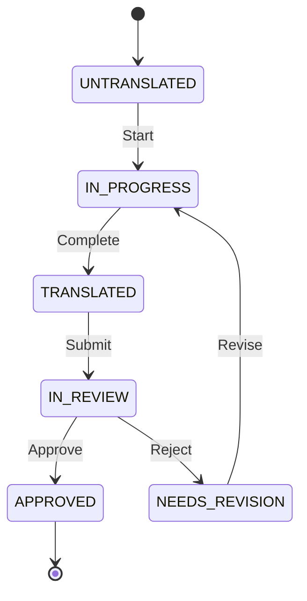

# 🚀 Phase 2 Roadmap - Professional Features

## 📋 Tổng Quan Phase 2

Phase 1 đã hoàn thành core features. Phase 2 sẽ nâng cấp app lên professional translation tool với:
- 👥 Multi-user collaboration
- ✅ Workflow management
- ⌨️ Advanced UX
- 📊 Analytics & reporting
- 🔐 Security & permissions

## ✅ Phase 1 Achievements

### Đã Hoàn Thành
- [x] Projects management (CRUD, stats)
- [x] Translation sheet (pagination, search, filter)
- [x] Glossary system (CRUD, auto-apply, auto-extract)
- [x] AI translation (OpenRouter, Mock)
- [x] Import/Export (JSON, CSV, Ren'Py)
- [x] Smart caching
- [x] **Manual status change** (NEW!)
- [x] **Save on blur** (NEW!)
- [x] **AI popup modal** (NEW!)
- [x] **Glossary integration** (FIXED!)
- [x] Complete documentation (11 files)

### Issues Resolved
- [x] Glossary terms apply to AI
- [x] Vietnamese input không bị interrupt
- [x] Text columns wide enough
- [x] Auto-extract filter duplicates
- [x] Edit glossary terms
- [x] AI popup (no scroll needed)

## 🎯 Phase 2 - Priority Features

### 🔐 1. Authentication & Authorization (Week 1)

**User Management:**
```typescript
interface User {
  id: string
  email: string
  username: string
  role: 'ADMIN' | 'TRANSLATOR' | 'REVIEWER' | 'VIEWER'
  avatar?: string
}
```

**Features:**
- [ ] Email/password login
- [ ] JWT authentication
- [ ] Password hashing (bcrypt)
- [ ] Session management
- [ ] Remember me
- [ ] Password reset

**Permissions:**
| Role | Create Project | Translate | Review | Approve | Manage Users |
|------|----------------|-----------|--------|---------|--------------|
| ADMIN | ✅ | ✅ | ✅ | ✅ | ✅ |
| TRANSLATOR | ❌ | ✅ | ❌ | ❌ | ❌ |
| REVIEWER | ❌ | ✅ | ✅ | ✅ | ❌ |
| VIEWER | ❌ | ❌ | ❌ | ❌ | ❌ |

**Implementation:**
```bash
# Backend
apps/backend/src/routes/auth.ts       # Login, register, logout
apps/backend/src/middleware/auth.ts   # JWT verification
apps/backend/src/middleware/rbac.ts   # Role-based access

# Frontend
apps/frontend/src/pages/LoginPage.tsx
apps/frontend/src/contexts/AuthContext.tsx
```

### ✅ 2. Workflow Management (Week 1)

**Status Workflow:**


**Features:**
- [x] Manual status change (DONE!)
- [ ] Workflow buttons (Approve, Reject, Submit)
- [ ] Status history tracking
- [ ] Notifications on status change
- [ ] Bulk status update

**UI:**
```tsx
// Quick action buttons per entry
<div className="flex space-x-1">
  {status === 'TRANSLATED' && (
    <button onClick={() => submitForReview(id)}>
      📤 Submit
    </button>
  )}
  {status === 'IN_REVIEW' && role === 'REVIEWER' && (
    <>
      <button onClick={() => approve(id)}>✓ Approve</button>
      <button onClick={() => reject(id)}>✗ Reject</button>
    </>
  )}
</div>
```

### 👥 3. Collaboration Features (Week 2)

**Project Members:**
- [ ] Add/remove members
- [ ] Assign entries to users
- [ ] See who's working on what
- [ ] Activity feed

**Comments:**
```typescript
interface Comment {
  id: string
  entryId: string
  userId: string
  content: string
  createdAt: Date
}
```

**Real-time (Optional):**
- [ ] WebSocket for live updates
- [ ] "User X is editing..." indicator
- [ ] Auto-refresh when others make changes

### ⌨️ 4. Keyboard Shortcuts (Week 2)

**Navigation:**
- `↑/↓` - Move between rows
- `Tab` - Next field
- `Enter` - Edit translation
- `Esc` - Cancel edit
- `Ctrl+S` - Save current
- `Ctrl+F` - Focus search

**Actions:**
- `Ctrl+Enter` - Save translation
- `Ctrl+I` - Request AI
- `Ctrl+A` - Apply AI suggestion
- `Ctrl+1-6` - Change status

**Implementation:**
```tsx
useEffect(() => {
  const handleKeyDown = (e: KeyboardEvent) => {
    if (e.ctrlKey && e.key === 'i') {
      e.preventDefault()
      requestAI(selectedEntry)
    }
    // ... more shortcuts
  }
  
  window.addEventListener('keydown', handleKeyDown)
  return () => window.removeEventListener('keydown', handleKeyDown)
}, [selectedEntry])
```

### 🎨 5. UI/UX Improvements (Week 2)

**Fix Row Jumping:**
```typescript
// Optimistic updates
const updateEntry = useMutation({
  mutationFn: api.update,
  onMutate: async (newData) => {
    await queryClient.cancelQueries(['entries'])
    const previous = queryClient.getQueryData(['entries'])
    
    // Update immediately in cache
    queryClient.setQueryData(['entries'], (old) => {
      // Update specific entry without re-fetching
    })
    
    return { previous }
  },
  onError: (err, newData, context) => {
    // Rollback on error
    queryClient.setQueryData(['entries'], context.previous)
  }
})
```

**Column Management:**
- [ ] Show/hide columns
- [ ] Resize columns
- [ ] Reorder columns
- [ ] Save layout preferences

**Advanced Search:**
- [ ] Regex search
- [ ] Multi-field search
- [ ] Saved searches
- [ ] Search history

### 📊 6. Analytics & Reporting (Week 3)

**Dashboard:**
```tsx
<Dashboard>
  <StatCard title="Progress" value="65%" />
  <StatCard title="Today" value="120 translations" />
  <StatCard title="AI Usage" value="$2.50" />
  <Chart data={progressOverTime} />
</Dashboard>
```

**Reports:**
- [ ] Translation progress
- [ ] AI usage & cost
- [ ] User productivity
- [ ] Quality metrics
- [ ] Export reports (PDF, Excel)

**Metrics:**
- Words per day
- AI acceptance rate
- Review time
- Cost per translation

### 🔧 7. Advanced Features (Week 3-4)

**Translation Memory:**
- [ ] Store approved translations
- [ ] Suggest from TM
- [ ] Fuzzy matching
- [ ] TM management

**Quality Assurance:**
- [ ] Spell check
- [ ] Character limit validation
- [ ] Placeholder validation ({0}, {name})
- [ ] Consistency checks
- [ ] Glossary compliance

**Bulk Operations:**
- [ ] Bulk edit
- [ ] Bulk status change
- [ ] Bulk AI translate (improved)
- [ ] Bulk approve/reject

### 🔍 8. Search & Filter Enhancements

**Advanced Filters:**
- [ ] By date range
- [ ] By translator
- [ ] By context
- [ ] By word count
- [ ] By AI confidence
- [ ] Complex queries

**Saved Views:**
- [ ] "My assignments"
- [ ] "Needs review"
- [ ] "Untranslated"
- [ ] Custom views

## 📅 Implementation Timeline

### Week 1: Foundation
- Authentication & Authorization
- Workflow management
- Manual status change (✅ DONE!)

### Week 2: Collaboration
- Comments system
- Keyboard shortcuts
- UI stability fixes
- Project members

### Week 3: Analytics
- Dashboard
- Reports
- Quality checks
- Translation memory

### Week 4: Polish
- Advanced search
- Bulk operations
- Performance optimization
- Production deployment

## 🛠️ Technical Requirements

### Backend
```typescript
// New routes needed
/api/auth/*           - Authentication
/api/users/*          - User management
/api/comments/*       - Comments
/api/assignments/*    - Entry assignments
/api/analytics/*      - Stats & reports
/api/tm/*             - Translation memory
```

### Frontend
```typescript
// New components
<AuthProvider>       - Auth context
<LoginPage>          - Login UI
<Dashboard>          - Analytics dashboard
<CommentThread>      - Comments UI
<KeyboardShortcuts>  - Shortcuts handler
<UserAvatar>         - User display
```

### Database
```sql
-- New tables
project_members      - User-project relationships
assignments          - Entry assignments
comments             - Comments on entries
translation_memory   - TM database
activity_log         - Activity tracking
```

## 🎯 Immediate Next Steps

### Option A: Quick Wins (1-2 days)
1. ✅ Manual status change (DONE!)
2. Keyboard shortcuts
3. UI stability (optimistic updates)
4. Comments basic

### Option B: Full Professional (4 weeks)
1. Complete authentication
2. Full workflow with review
3. Analytics dashboard
4. Translation memory

### Option C: Pick Features
Choose specific features you need most:
- Authentication?
- Collaboration?
- Analytics?
- Advanced UX?

## 💡 Recommendations

**For Solo/Small Team:**
- Focus on UX improvements
- Keyboard shortcuts
- Better search
- Skip authentication

**For Professional Use:**
- Full authentication
- Workflow management
- Collaboration tools
- Analytics

**For Large Teams:**
- All Phase 2 features
- Real-time collaboration
- Advanced analytics
- Custom permissions

## 📊 Current vs Phase 2

| Feature | Phase 1 | Phase 2 |
|---------|---------|---------|
| Users | Single | Multi-user |
| Workflow | Basic | Full review process |
| Status | Manual dropdown ✅ | With permissions |
| Comments | ❌ | ✅ |
| Analytics | ❌ | ✅ Dashboard |
| Real-time | ❌ | ✅ WebSocket |
| Shortcuts | ❌ | ✅ Full set |
| TM | ❌ | ✅ |
| QA | Basic | Advanced |

---

## 🚀 Ready to Start Phase 2?

Current app is **production-ready for personal/small team use**.

**For Phase 2**, pick your priority:
1. **Quick wins** (UX improvements)
2. **Professional** (Auth + Workflow)
3. **Enterprise** (Full features)

**Which path do you want to take?**