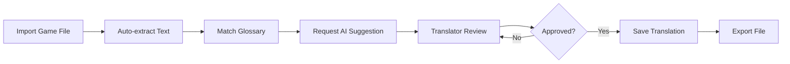

# Game Translation Tool - Công Cụ Dịch Thuật Text Game

## 📖 Tổng Quan

Công cụ dịch thuật chuyên biệt dành cho text game với hỗ trợ AI, quản lý glossary thông minh và giao diện làm việc dạng bảng tính.

## ✨ Tính Năng Chính

### 🎮 Quản Lý Dự Án
- Tạo và quản lý nhiều dự án game độc lập
- Hỗ trợ nhiều định dạng game: JSON, CSV, Ren'Py, RPG Maker, XML
- Import/Export dễ dàng
- Theo dõi tiến độ dịch theo thời gian thực

### 📚 Hệ Thống Glossary
- Glossary riêng cho từng dự án
- Auto-apply thuật ngữ khi dịch
- Phân loại theo category
- Hỗ trợ aliases và variations
- Global glossary cho thuật ngữ chung

### 📊 Giao Diện Sheet
- Bảng làm việc trực quan như Excel/Google Sheets
- Virtual scrolling cho hiệu năng cao
- In-line editing nhanh chóng
- Filter, search, sort mạnh mẽ
- Bulk operations
- Auto-save thông minh

### 🤖 AI Translation
**Miễn Phí:**
- Google Gemini Flash (60 requests/phút)
- Ollama (local, offline, unlimited)

**Trả Phí:**
- OpenAI GPT-4o (chất lượng cao)
- Claude Sonnet (tốt cho narrative games)

**Tính năng AI:**
- Context-aware translation
- Tích hợp glossary vào prompt
- Confidence scoring
- Multiple suggestions
- Caching thông minh

### 👥 Cộng Tác
- Nhiều người dùng cùng làm việc
- Phân quyền rõ ràng (Admin, Translator, Reviewer, Viewer)
- Translation workflow (Draft → Review → Approved)
- Comment và feedback
- History tracking

## 🏗️ Kiến Trúc

```
Frontend (React + TypeScript)
    ↓
Backend API (Node.js + Express)
    ↓
├── Database (PostgreSQL)
├── Cache (Redis)
├── File Storage (S3/MinIO)
└── AI Services (Gemini/OpenAI/Claude)
```

Chi tiết kiến trúc: [ARCHITECTURE.md](ARCHITECTURE.md)

## 🚀 Bắt Đầu Nhanh

### Cài Đặt

```bash
# Clone repository
git clone <repo-url>
cd glossary-tool

# Install dependencies
npm install

# Setup environment variables
cp .env.example .env
# Cập nhật .env với API keys và database config

# Run migrations
npm run migrate

# Start development server
npm run dev
```

### Cấu Hình AI Services

```env
# Free tier (không cần API key)
USE_GEMINI=true

# Paid tier (cần API keys)
OPENAI_API_KEY=sk-...
ANTHROPIC_API_KEY=sk-ant-...
```

## 📦 Tech Stack

### Frontend
- **Framework**: React 18 + TypeScript
- **UI Library**: Shadcn/ui + Tailwind CSS
- **Sheet Component**: AG Grid / TanStack Table
- **State**: Zustand
- **Forms**: React Hook Form + Zod

### Backend
- **Runtime**: Node.js 20+
- **Framework**: Express.js / Fastify
- **ORM**: Prisma
- **Database**: PostgreSQL 15+
- **Cache**: Redis
- **Auth**: JWT + bcrypt

### AI Integration
- Google Gemini API
- OpenAI API
- Anthropic Claude API
- Ollama (optional, local)

## 📖 Sử Dụng

### 1. Tạo Dự Án Mới

```typescript
// Tạo project
const project = await createProject({
  name: "My Visual Novel",
  gameFormat: "renpy",
  sourceLang: "en",
  targetLang: "vi"
});
```

### 2. Import Game File

```typescript
// Upload và parse file
const entries = await importGameFile(projectId, {
  file: gameScript.rpy,
  format: "renpy"
});
// → Auto-extract text entries
```

### 3. Setup Glossary

```typescript
// Thêm thuật ngữ
await addGlossaryTerm(projectId, {
  source: "Health Potion",
  target: "Thuốc Hồi Máu",
  category: "items"
});
```

### 4. Dịch Với AI

```typescript
// Request AI translation
const suggestion = await translateWithAI({
  text: "Hello, brave adventurer!",
  context: "dialogue",
  glossary: projectGlossary,
  service: "gemini" // hoặc "gpt-4o"
});

// → "Xin chào, chiến binh dũng cảm!"
```

### 5. Export Kết Quả

```typescript
// Export translated file
const output = await exportProject(projectId, {
  format: "renpy",
  includeOriginal: true
});
```

## 🎯 Workflow Dịch Thuật



## 📊 Ví Dụ Sheet Interface

```
┌─────────────────────────────────────────────────────────────────┐
│ Project: Visual Novel XYZ          Progress: 245/1000 (24.5%)  │
├────┬──────────┬─────────────────┬──────────────┬──────┬────────┤
│ ID │ Context  │ Original        │ Translation  │ AI   │ Status │
├────┼──────────┼─────────────────┼──────────────┼──────┼────────┤
│ 001│ dialogue │ Hello!          │ Xin chào!    │ 💡   │ ✓      │
│ 002│ menu     │ Start Game      │ Bắt đầu game │ 💡   │ ✓      │
│ 003│ item     │ Health Potion   │ Thuốc Máu    │ 📚   │ 👁️     │
└────┴──────────┴─────────────────┴──────────────┴──────┴────────┘

Legend:
💡 = AI suggestion   📚 = From glossary
✓ = Approved        👁️ = In review
```

## 🔧 API Endpoints

```typescript
// Projects
POST   /api/projects              // Create project
GET    /api/projects              // List projects
GET    /api/projects/:id          // Get project details

// Entries
GET    /api/projects/:id/entries  // List entries (paginated)
PUT    /api/entries/:id           // Update entry translation

// Glossary
GET    /api/projects/:id/glossary // Get glossary
POST   /api/glossary              // Add term

// AI
POST   /api/ai/translate          // Get AI translation
POST   /api/ai/translate/batch    // Batch translate

// Import/Export
POST   /api/projects/:id/import   // Import game file
GET    /api/projects/:id/export   // Export translated file
```

## 💰 Pricing (Tùy Chọn)

### Free Tier
- 1 project
- 1000 entries/project
- 100 glossary terms
- Gemini Flash AI only
- Community support

### Pro Tier - $9.99/month
- Unlimited projects
- Unlimited entries
- Unlimited glossary
- All AI services
- Priority support

### Team Tier - $29.99/month
- Everything in Pro
- Team collaboration
- Advanced analytics
- API access

## 🛣️ Roadmap

### Phase 1 (MVP) ✅
- [x] Basic project management
- [x] Sheet interface
- [x] Glossary system
- [x] AI integration (Gemini)
- [x] Import/Export (JSON, CSV)

### Phase 2 🚧
- [ ] User authentication
- [ ] Team collaboration
- [ ] Translation memory (TM)
- [ ] Quality assurance checks
- [ ] More game formats (Ren'Py, RPG Maker)

### Phase 3 🔮
- [ ] Advanced AI (GPT-4o, Claude)
- [ ] Custom model fine-tuning
- [ ] Mobile app
- [ ] Plugin system
- [ ] Analytics dashboard

## 🤝 Đóng Góp

Contributions are welcome! Xem [CONTRIBUTING.md](CONTRIBUTING.md) để biết thêm chi tiết.

## 📄 License

MIT License - xem [LICENSE](LICENSE) để biết thêm chi tiết.

## 📞 Liên Hệ

- **Issues**: [GitHub Issues](https://github.com/username/glossary-tool/issues)
- **Discussions**: [GitHub Discussions](https://github.com/username/glossary-tool/discussions)
- **Email**: support@glossary-tool.com

## 🙏 Acknowledgments

- Inspired by CAT tools like OmegaT, Trados
- Built with amazing open-source tools
- Thanks to the game translation community

---

Made with ❤️ for game translators